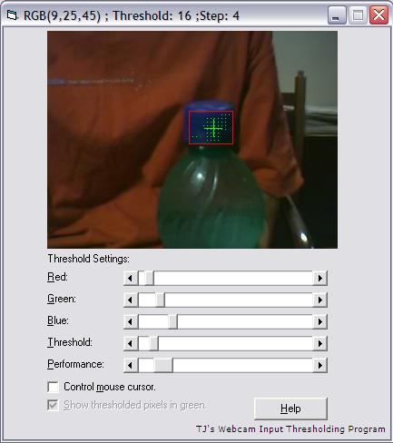



## TJ's Webcam Input Thresholding Program

### Description

Get webcam input without using clipboard. Threshold webcam input according to variables, with several different thresholding functions provided. Track object. Motion detection. Control mouse cursor by waving object infront of webcam. Pretty much a nice template to be expanded into some cool, sophisticated and advanced program.
 
### More Info
 
A webcam.

Set your webcam's aspect ratio setting to 320:240.

A threshold overlay on the webcam input, showing thresholded pixels.

Feeling overly excited about this program.

             |
---                |---
**Submitted On**   |2006-09-08 09:43:40
**By**             |[jian2587](https://github.com/Planet-Source-Code/PSCIndex/blob/master/ByAuthor/jian2587.md)
**Level**          |Intermediate
**User Rating**    |4.5 (50 globes from 11 users)
**Compatibility**  |VB 4\.0 \(32\-bit\), VB 5\.0, VB 6\.0
**Category**       |[Graphics](https://github.com/Planet-Source-Code/PSCIndex/blob/master/ByCategory/graphics__1-46.md)
**World**          |[Visual Basic](https://github.com/Planet-Source-Code/PSCIndex/blob/master/ByWorld/visual-basic.md)
**Archive File**   |[TJ's\_Webca201857972006\.zip](https://github.com/Planet-Source-Code/jian2587-tj-s-webcam-input-thresholding-program__1-66493/archive/master.zip)

